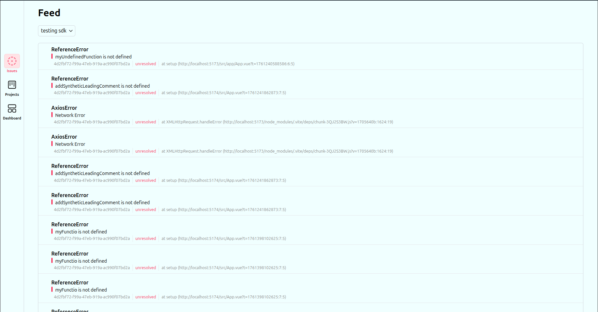
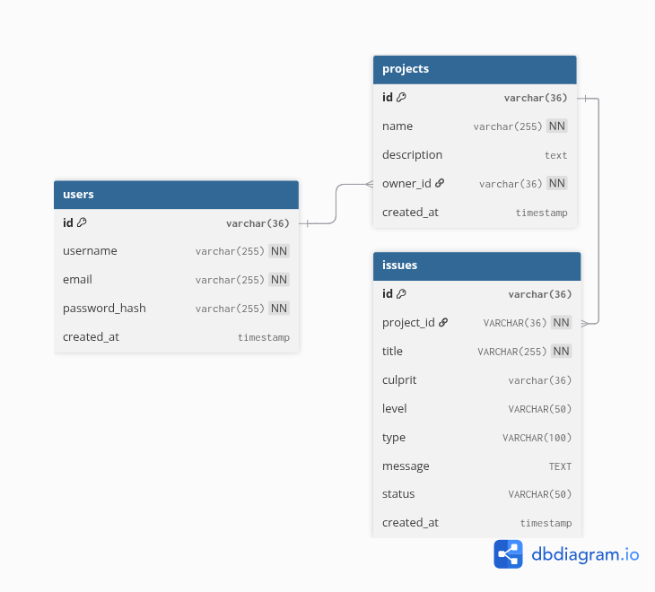

# Simple Senty clone

A minimal error monitoring and logging system inspired by Sentry.
It collects application errors, stores them, and displays them in a simple dashboard feed.

---

## Features

- 📥 Capture application errors

- 🧾 Store error logs

- 📊 Display error feed

- 🕒 Timestamped events

- 🔎 Basic error inspection

---

## Screenshots



---

## How It Works

1. An application sends error events to the backend API.

2. The backend stores these events.

3. The dashboard fetches and displays the errors in a feed view.

### Basic flow:

`Application -> Error API -> Storage -> Dashboard Feed`

---

## Technology stack

Frontend

- Vue 3
- Pinia
- Vue Router
- Tailwind CSS
- Axios
- Iconify (icons)

Backend

- Express
- JWT
- PostgreSQL

---

### Database Schema



In addition, you can find some of the already prepared queries [here](./server/queries.sql)

---

## Running the Project

1. Clone the repository

```
git clone https://github.com/karal63/sentry-clone.git sentry-clone
```

2. Install dependencies

```
npm install
```

3. Start the server

```
npm run dev
```

4. Open the dashboard

```
http://localhost:3000
```

---

## Example error event

```js
projectId: '0f',
title: "Error example",
culprit: "at setup (http://localhost:5173/src/app/App.vue?t=1761240588586:6:5)",
level: "error",
type: "AxiosError",
message: "Network Error",
stack: "",
timestamp: "12-10-2025 16:00"
```

---

## References

- [Sentry Clone SDK](https://github.com/karal63/sentry-clone-sdk)

---

## Inspiration

Inspired by the error monitoring platform Sentry, but intentionally simplified for learning purposes.

---

## Author

This project was created as part of preparation for an IT internship and as a learning exercise to explore modern development workflows and tooling.

During development, the project focused on gaining practical experience with:

- Git hooks automation using Husky and lint-staged

- Integration between multiple services and tools (Sentry Clone SDK --> Sentry Clone)

- CI/CD pipelines using GitHub Actions

- Database design and management with PostgreSQL
